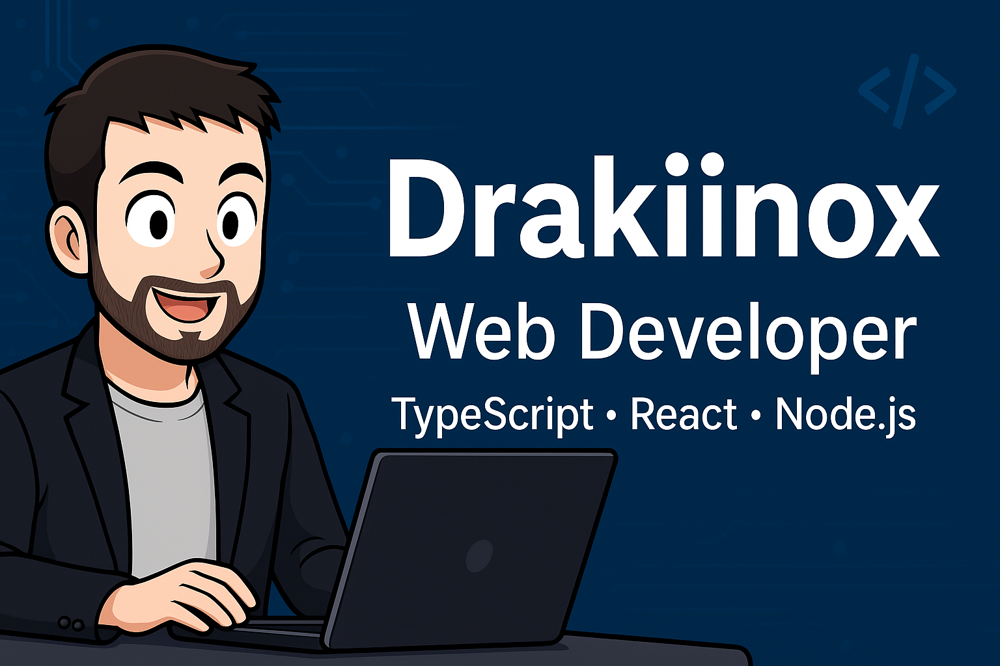

<!-- 🌟 GitHub Profile README – Drakiinox 🌟 -->

  

  

---

### 👨‍💻 About Me

Hi! I’m **Nicolas**, a **web developer in career transition** passionate about building modern, efficient, and well-structured web applications.  
I enjoy crafting **reactive UIs** with **React.js** and **TypeScript**, and developing robust **APIs** with **Node.js**.  
Currently seeking an opportunity to grow as a developer and contribute to meaningful, collaborative projects.

---

### 🧠 What I'm focusing on
- Deepening my knowledge of **React Hooks**, **Context API**, and scalable architecture  
- Writing maintainable **TypeScript** code with strong typing practices  
- Optimizing UI/UX with **Tailwind CSS** and **Vite**

---

### 🚀 Tech Stack

**Languages & Frameworks:**  

**Tools & Environment:**  

---

### 📊 GitHub Stats

  
  

  

---

### 🌐 Connect with Me

  
  

---

  

---

> 🧩 *"The best way to learn is by building."*  
> — **Nicolas**

---

<!--
**Drakiinoxx/Drakiinoxx** is a ✨ _special_ ✨ repository because its `README.md` (this file) appears on your GitHub profile.

Here are some ideas to get you started:

